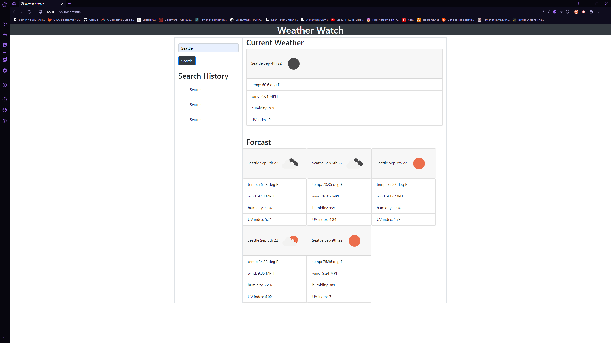

# weather-api #

## Description ##
Weather Watch

## Table of Contents ##
* [Description](#Description "Goto Description")
* [Installation](#installation "installation")
* [Usage Info](#Usage-Info "Usage-Info")
* [License](#License "Goto License")
* [Video Tutorial](#Video-Tutorial "Goto Video Tutorial")
* [Questions](#Questions "Goto Questions")

## Installation ##
Visit Website - [Weather Watcher](https://deamonbunny.github.io/weather-api/ "Weather Watcher")

## Usage Info ##
- Go to website [Weather Watcher](https://deamonbunny.github.io/weather-api/ "Weather Watcher")
- Search for City on in the search bar
- check past searches using the left side history bar

## Images ##

## License ##
MIT

## Questions ##
Reach my GitHub Account, [deamonbunny](https://github.com/deamonbunny "My GitHub")
